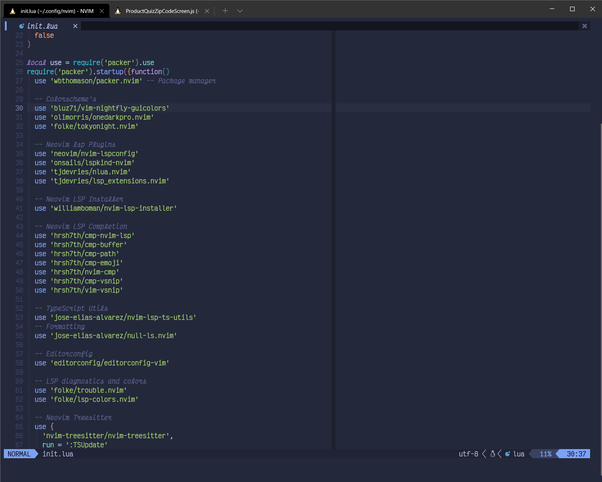

# config

My Dotfiles Neovim, Alacritty, Kitty and ZSH config

## Install In One Command!

```bash
bash <(curl -s https://raw.githubusercontent.com/jamespotz/config/master/setup.sh)
```

# Neovim Setup



## Language Server's

- Tsserver
- sqlls
- html
- cssls
- dockerls

## Installing LSP

```sh
:LspInstall tsserver sqlls html cssls dockerls
```
